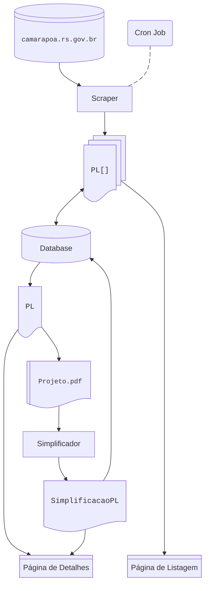
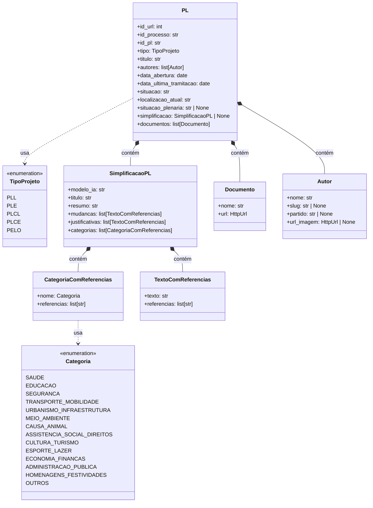

## Diagrama de fluxo de dados

```mermaid
graph
    Camara@{ shape: lin-cyl, label: "<pre>camarapoa.rs.gov.br</pre>" }
    CronJob@{ shape: event, label: "Cron Job" }
    PLs@{ shape: docs, label: "<pre>PL[]</pre>" }
    DB@{ shape: db, label: "&nbsp;&nbsp;&nbsp;&nbsp;&nbsp;&nbsp; Database &nbsp;&nbsp;&nbsp;&nbsp;&nbsp;&nbsp;" }
    PL@{ shape: doc, label: "<pre>PL</pre>" }
    PDF@{ shape: lin-doc, label: "<pre>Projeto.pdf</pre>" }
    SimplificacaoPL@{ shape: doc, label: "<pre>SimplificacaoPL</pre>" }
    PaginaListagem@{ shape: div-rect, label: "Página de Listagem" }
    FrontDetalhes@{ shape: div-rect, label: "Página de Detalhes" }

    Camara --> Scraper
    CronJob e1@--- Scraper
    Scraper --> PLs
    PLs <--> DB
    PLs -------> PaginaListagem
    DB --> PL
    PL --> PDF
    PL --> FrontDetalhes
    PDF --> Simplificador
    Simplificador --> SimplificacaoPL
    SimplificacaoPL --> DB
    SimplificacaoPL --> FrontDetalhes

    e1@{ animate: true }
    classDef text-sm font-size:0.875rem
    classDef text-lg font-size:0.875rem
    class Camara,PDF text-sm
```

## Diagrama de classes

```mermaid
classDiagram
    class Categoria {
        <<enumeration>>
        SAUDE
        EDUCACAO
        SEGURANCA
        TRANSPORTE_MOBILIDADE
        URBANISMO_INFRAESTRUTURA
        MEIO_AMBIENTE
        CAUSA_ANIMAL
        ASSISTENCIA_SOCIAL_DIREITOS
        CULTURA_TURISMO
        ESPORTE_LAZER
        ECONOMIA_FINANCAS
        ADMINISTRACAO_PUBLICA
        HOMENAGENS_FESTIVIDADES
        OUTROS
    }

    class TipoProjeto {
        <<enumeration>>
        PLL
        PLE
        PLCL
        PLCE
        PELO
    }

    class CategoriaComReferencias {
        +nome: Categoria
        +referencias: list[str]
    }

    class TextoComReferencias {
        +texto: str
        +referencias: list[str]
    }

    class SimplificacaoPL {
        +modelo_ia: str
        +titulo: str
        +resumo: str
        +mudancas: list[TextoComReferencias]
        +justificativas: list[TextoComReferencias]
        +categorias: list[CategoriaComReferencias]
    }

    class Documento {
        +nome: str
        +url: HttpUrl
    }

    class Autor {
        +nome: str
        +slug: str | None
        +partido: str | None
        +url_imagem: HttpUrl | None
    }

    class PL {
        +id_url: int
        +id_processo: str
        +id_pl: str
        +tipo: TipoProjeto
        +titulo: str
        +autores: list[Autor]
        +data_abertura: date
        +data_ultima_tramitacao: date
        +situacao: str
        +localizacao_atual: str
        +situacao_plenaria: str | None
        +simplificacao: SimplificacaoPL | None
        +documentos: list[Documento]
    }

    CategoriaComReferencias ..> Categoria : usa
    SimplificacaoPL *-- CategoriaComReferencias : contém
    SimplificacaoPL *-- TextoComReferencias : contém
    PL *-- SimplificacaoPL : contém
    PL *-- Documento : contém
    PL *-- Autor : contém
    PL ..> TipoProjeto : usa
```
