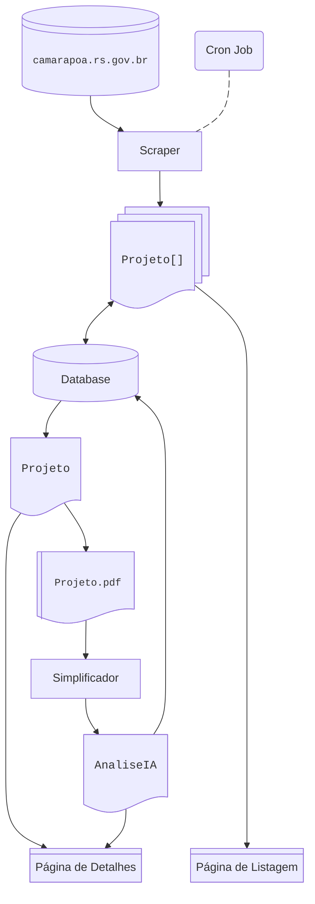
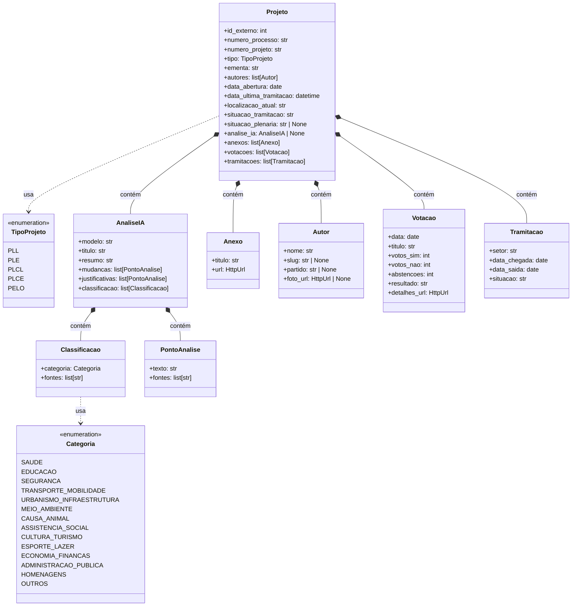

# Voz Cívica

An automated system designed to scrape, process, and translate legislative documents from the Porto Alegre City Council into plain, accessible language. The project infrastructure is divided into a Python-based data worker and a Svelte-based web interface.

## Architecture

### Worker service

The worker service handles data ingestion and is built with Python.

* **Scraping:** Automated extraction of bill metadata and PDF attachments from the official city council server ([camarapoa.rs.gov.br](https://www.camarapoa.rs.gov.br)) using `httpx` and `BeautifulSoup4`. A cron job triggers this extraction process.
* **Document processing:** Text extraction from downloaded PDF documents is handled by `PyMuPDF`.
* **AI analysis:** The system integrates with the Gemini API (`google-genai`) to parse legal terminology and generate plain-language summaries. The analyzer prompts the model to extract practical impacts, author justifications, and document categories.
* **Data persistence:** Relational data storage utilizing SQLite. The schema defines tables for projects, authors, structural AI analyses, and traceability mappings linking generated text to exact source quotes.

### Web service

The web interface presents the processed legislative data to end users.

* **Framework:** Built with Svelte 5 and SvelteKit 2.
* **Styling:** Utilizes Tailwind CSS for utility-first styling.
* **Features:** Renders original PDF documents within the browser using `pdfjs-dist`, alongside the simplified AI-generated text.

## Data flow

1. A scheduled cron job initiates the scraper module.
2. The scraper fetches legislative bills (`Projetos`) and their respective PDFs, storing them in the database.
3. The analyzer (`Simplificador`) processes the PDFs through the AI model to generate structural summaries (`AnaliseIA`).
4. The analysis is persisted in the database, mapping practical changes and justifications to their original text sources.
5. The web application retrieves this data to render listing and detail pages for public viewing.

## Classes

